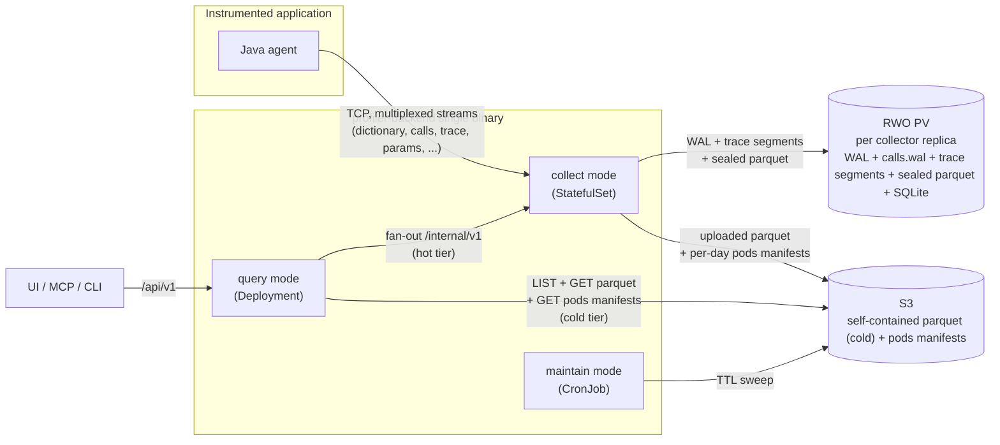
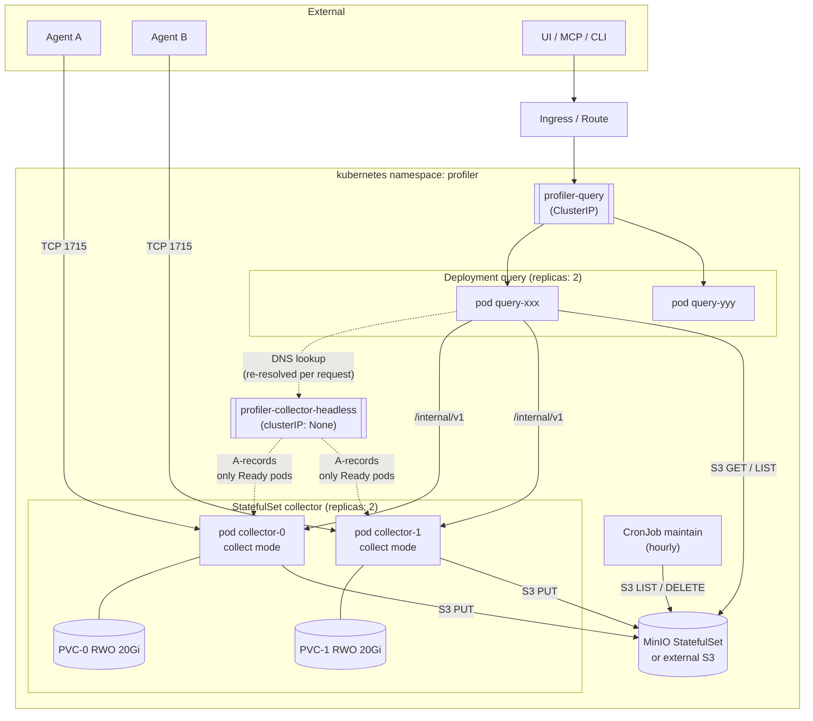
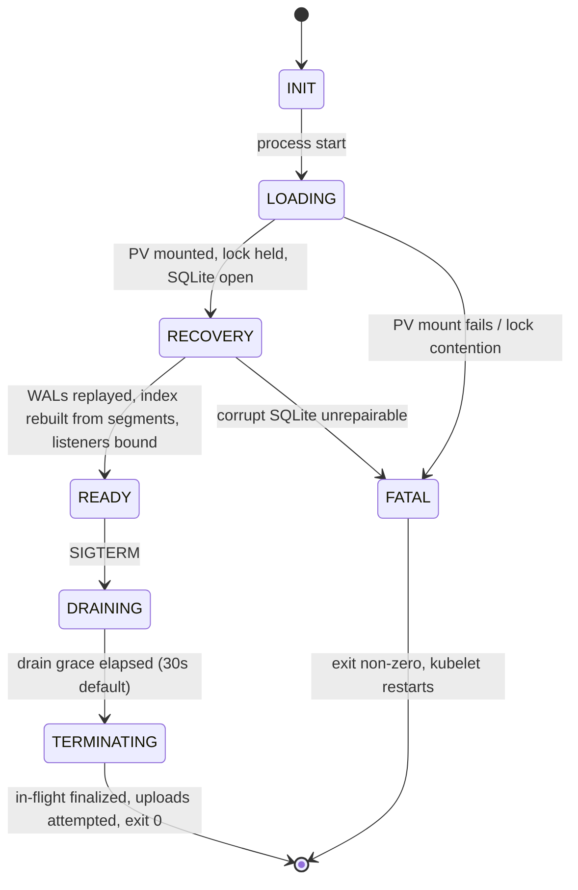
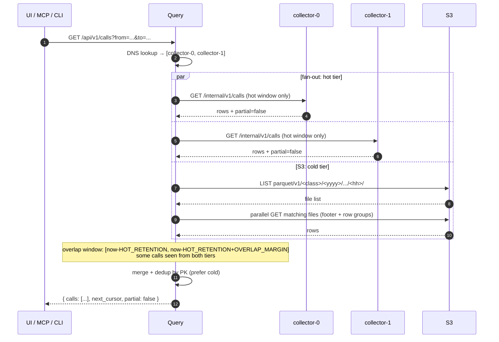

# 05 — Diagrams

> Status: **draft**, awaiting review. Mermaid-encoded visual summaries of the contracts in 01–04. The diagrams are derived views; if any disagrees with a contract document, the contract document wins.

## 1. Scope

Six diagrams covering the system end-to-end:

1. **Data flow** — agent stream → collector → S3 ↔ query → client.
2. **Deployment topology** — k8s workloads, services, storage.
3. **Collector state machine** — startup, recovery, shutdown.
4. **Per-call write-side lifecycle** — chunk arrival → per-call blob → parquet → S3.
5. **Hot/cold read flow** — query fan-out and merge.
6. **Pod-restart lifetime** — when each on-disk and S3 artifact appears and disappears.

Diagrams render in any Mermaid-aware viewer (GitHub, VS Code, Obsidian, mermaid.live).

## 2. Data flow (system-level)



**Key invariants visible here:**

- Agent → collector is the only ingestion path. There is no other writer of trace data.
- The PV holds only collector-private state (per `01-write-contract.md` §8). It is not shared between replicas.
- S3 is the cold-tier authoritative store. All other tiers can be reconstructed from it if needed (modulo the in-flight hot window).
- `maintain` never reads from PV — it operates only on S3 metadata + listings.

## 3. Deployment topology



**What this shows:**

- Stable pod identity per StatefulSet ordinal (`collector-0`, `collector-1`); each owns one PVC for life.
- The headless service is the discovery mechanism for `query`. Only `Ready` collector pods appear in DNS, so a recovering pod never gets hot reads.
- Agents pick a collector replica when they dial port 1715. There is no LB in front; sticky-per-TCP-connection is implicit.
- All three workloads talk to S3 directly. None go through each other for object access.

## 4. Collector state machine



**Readiness behavior:**

- `INIT`, `LOADING`, `RECOVERY`, `DRAINING`, `TERMINATING`, `FATAL` → readiness probe `503`.
- `READY` → readiness probe `200`.
- Liveness probe returns `200` in all states except `FATAL` and process-level deadlock (which we don't have a separate diagram for; see `03-lifecycle.md` §4).

The asymmetry between liveness and readiness is deliberate: a slow recovery should not get the pod killed and reset — only kicked out of DNS until it stabilizes.

## 5. Per-call write-side lifecycle

```mermaid
sequenceDiagram
    autonumber
    participant Agent
    participant Collector
    participant Seg as PV trace/<seq>.gz
    participant Wal as PV calls.wal
    participant SQLite as metadata.sqlite
    participant Parquet as PV sealed parquet
    participant S3

    Note over Agent,Collector: TCP open + PROTOCOL_V2 handshake → restart_time_ms stamped

    Agent->>Collector: chunk N (header [threadId, startTime])
    Collector->>Seg: append raw stream (one gzip member)
    Collector->>SQLite: segment catalog += (segment, offset, len, threadId)
    Collector->>Collector: chunk_index[threadId] += (segment, offset, len)

    Note over Agent: ... many chunks of many threads interleave ...

    Agent->>Collector: Call record (thread T, summary metrics, start-pointer)
    Collector->>Wal: append full Call record
    Collector->>SQLite: call index += (PK, filter cols, bucket, wal offset); mark bucket dirty

    Note over Collector: ... bucket end + grace (5 min + 30s) → seal pass ...
    Collector->>SQLite: select calls where bucket = B
    Collector->>Seg: walk referenced segments in order (decompress each once)
    Collector->>Wal: read remaining columns by offset
    Collector->>Parquet: write rows (trace_blob assembled, routed by retention_class)
    Collector->>S3: PUT parquet object(s)
    S3-->>Collector: 200 OK
    Collector->>SQLite: uploaded_at = now(); advance seal watermark; segment refcount -= 1

    Note over Collector: ... hot_retention elapses (default 15 min past upload) ...
    Collector->>Parquet: delete local file
    Collector->>SQLite: remove parquet_local row

    Note over Collector: ... segment refcount == 0 ...
    Collector->>Seg: unlink trace/<seq>.gz
    Collector->>SQLite: remove segment row
```

**Visible in this diagram:**

- The write path parses only chunk headers; the seal pass walks events to the depth-0 exit to bound each blob (`01-write-contract.md` §4.3).
- Parquet is materialized only at seal, one bucket at a time — never appended per Call (`01-write-contract.md` §6.5).
- Local parquet outlives the S3 upload by `hot_retention`, then is deleted (`01-write-contract.md` §6.3; `02-read-contract.md` §4.2).
- A trace segment outlives a call until its bucket seals and uploads (refcount 0).
- `metadata.sqlite` holds the call index, refcounts, seal watermarks, and upload checkpoints; everything on the PV is rebuildable from it and the WALs.

## 6. Hot/cold read flow



**Key behaviors visible:**

- Three parallel reads, all bounded by `PROFILER_FANOUT_TIMEOUT`. Partial failure → `partial: true`, not an error.
- Dedup is unconditional, even when sticky TCP "should" prevent dupes — protects against replica transitions, retries, and overlap window.
- Cold path uses S3 LIST per `<retentionClass>/<yyyy>/<mm>/<dd>/<hh>/` prefix; no manifest yet (`02-read-contract.md` §5.3).

## 7. Artifact lifetime reference

A Mermaid `gantt` doesn't render this well because the time scales span three orders of magnitude (minutes for live ingestion vs. days for S3 retention). Tabular form is clearer:

| Artifact | Storage | Created at | Removed at |
|---|---|---|---|
| Agent TCP connection | network | TCP accept | TCP close (agent crash, collector crash, collector shutdown) |
| Dictionary WAL | local PV | First dictionary chunk arrives | After every sealed file is uploaded + 1 h grace |
| `calls.wal` | local PV | First Call record arrives | After every bucket it covers is sealed and uploaded |
| Trace segment | local PV | First chunk of a new segment | When `refcount = 0` (every call sourced from it sealed and uploaded to S3) |
| Parquet writers (per seal pass) | RAM | A seal pass starts for a bucket | When that seal pass ends (`01-write-contract.md` §6.5) |
| Sealed parquet (not yet uploaded) | local PV | Seal pass finishes a file | After S3 upload succeeds |
| Hot-retained parquet (uploaded, still local) | local PV | After S3 upload | `uploaded_at + PROFILER_HOT_RETENTION` (15 min default) |
| Parquet in S3 | S3 | First S3 PUT success | Per retention class TTL (`01-write-contract.md` §6.4) |
| Pods manifest in S3 | S3 | First seal of the (day, pod-restart) uploads | `PROFILER_RETENTION_PODS_TTL` (185 d default) |

Three invariants the table encodes:

- Trace segments outlive the Agent TCP connection — finalization (sealing the closed pod-restart's dirty buckets) needs the segment data.
- A sealed row carries the dictionary subset and the suspend pauses its own blob needs (`01-write-contract.md` §3.6), so parquet in S3 stays decodable for its whole TTL with no companion object.
- The pods-manifest TTL (185 d) exceeds the longest parquet retention class (180 d, `huge_clean` / `any_error`) by a safety margin, so a readable row never outlives the manifest naming its pod-restart.

## 8. What this contract does NOT cover

- **Sequence of agent-side instrumentation** (how the bytecode rewriter, runtime, and dumper interact to produce the wire stream) — out of scope for backend design. See `agent/`, `dumper/`, `runtime/` modules.
- **Maintain job internals** (compaction algorithms, S3 listing patterns) — covered briefly in `profiler-plan.md`, detailed when Stage 4 begins.
- **Auth flow** (Keycloak, Bearer, etc.) — deferred; no MVP auth (`02-read-contract.md` §1).

## 9. Review checklist

- [ ] Diagram coverage — anything important missing?
- [x] Mermaid rendering — verified in the reviewer's environment.
- [ ] Cross-references to other contracts (§ numbers) accurate?
- [ ] Naming consistent across diagrams (e.g. `collector-0`, `PROFILER_*` env vars)?
- [x] §7 lifetime view — replaced Mermaid `gantt` with a table; Gantt's mixed time scale was unreadable.
