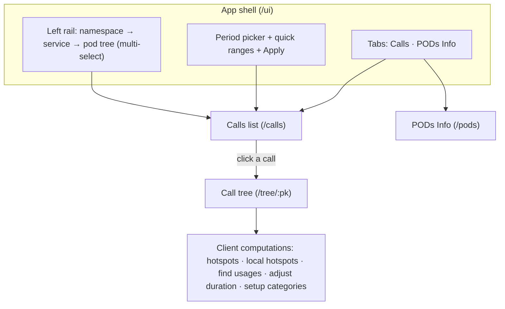
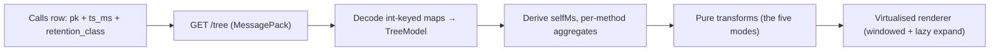
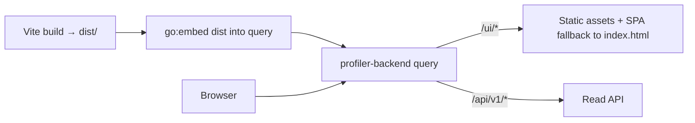

# 07 — UI design (Stage 5): Calls Viewer

Stage 5 replaces the profiler UI with a single-page app that runs on the new `query` API and builds
without the archived `@netcracker/*` npm registry. This document is the contract between the UI and
`query`, the information architecture, the call-tree engine design, and the staged plan. The API is
specified in [`02-read-contract.md`](02-read-contract.md); that document stays the source of truth for
every endpoint shape. Stage framing is in [`profiler-plan.md`](profiler-plan.md) §"Stage 5".

## 1. Scope

The old UI assumed one Java process: open a calls table, filter, drill into a tree, all served from local
files by the same JVM. The new UI is cluster-wide and multi-tenant: it discovers pod-restarts across
namespaces and services, lists their calls from the `query` fan-out, and drills into a per-call tree.

In scope for v1:

- Discovery: a `namespace → service → pod` tree with multi-select, built from `/pods`.
- Period selection: absolute range plus quick ranges (last 15 min / 1 h / 2 h / 4 h).
- Calls list: keyset-paginated table with duration-threshold quick filters and a method-substring query.
- Call tree: decode the MessagePack `/tree`, render it virtualised, and run the five client-side
  computations (§5.3).
- Deployment: the compiled assets ship inside the `query` binary via `go:embed`, served at `/ui`.

Out of scope for v1 (deferred, with reasons in §8):

- The summary Dashboard (distribution donuts, per-service time series). Grafana already covers cluster
  summaries; `profiler-plan.md` §"Ideas / open" names a Grafana board as the alternative to a UI
  analytics screen. The backing `/stats` endpoint is deferred to Stage 4 anyway.
- Ranked-by-duration and ranked-by-SQL/RPC views — no backend support until `/stats` (§3.3).
- Heap-dumps polish and authentication. Per-node CPU stays out (the old tree never showed it), but per-node
  *suspension* and a *merged* tree are requirements, not deferrals — see
  [`08-ui-backend-requirements.md`](08-ui-backend-requirements.md).

## 2. Decisions (locked)

| # | Decision | Rationale |
|---|----------|-----------|
| D1 | **Salvage the shell only.** Start a clean AntD app targeting `/api/v1`. Port framework-agnostic logic (tree search, tree utils) and UX patterns (column management, calls-table layout) as reference; do not carry the 51-file `@netcracker/*` coupling or the dead `/cdt/v2` client. | The `@netcracker/*` → AntD migration is unavoidable in Stage 5 regardless; a clean start avoids also carrying an obsolete contract. |
| D2 | **Rewrite the five tree computations in TypeScript** over the new `Node` shape. Single SPA, no jQuery, no `profiler.mjs`. | Keeps one codebase and one render path; the draft has none of the five, so there is no React work to preserve either way. |
| D3 | **No Dashboard in v1.** | Avoids duplicating Grafana; `/stats` is not available until Stage 4. |
| D4 | **Embed the assets in `query` via `go:embed`, served at `/ui`.** | One service, one image, same origin — no CORS. `query` already exposes a composable `Handler` (`backend/libs/query/service.go`). |
| D5 (derived) | **TypeScript, not JavaScript.** Kotlin/JS ruled out (backend is Go). | AntD is TypeScript-first, and the MessagePack decoder and frozen-query contract earn static types. The data layer is a thin typed `fetch` over `/api/v1`, not RTK Query: data loads only on Apply (09 §2.2), pages 2..N ride an opaque server-frozen cursor (02 §2.3.1), and `/tree` is immutable binary already under HTTP caching, so a declarative cache would have nothing to manage. |
| D6 (derived) | **Plain AntD 6 only.** Drop `@netcracker/ux-react`, `@netcracker/cse-ui-components`, `@netcracker/ux-assets`. | The archived registry is unreachable for external contributors; `profiler-plan.md` §"Stage 5" mandates the removal. AntD 6, not the pre-Stage-5 4.24 pin, is what shipped — the UI is built on AntD 6 APIs, so this unlocks the 4.24 pin rather than downgrading. |

## 3. UI ↔ query contract

The UI depends only on the external `/api/v1/*` surface (§2 of the read contract). It never talks to
collector replicas or S3 — the fan-out and merge are `query`'s job.

### 3.1 Endpoints the UI consumes

| Screen / need | Endpoint | Key params | Response fields used |
|---------------|----------|------------|----------------------|
| Discovery tree | `GET /api/v1/pods` | `from`, `to` (Unix ms) | `namespace`, `service`, `pod`, `restart_time_ms`, `time_min_ms`, `time_max_ms` |
| Calls list | `GET /api/v1/calls` | `from`, `to`, `pod` (repeatable `ns/svc/pod`), `method`, `duration_min_ms`, `duration_max_ms`, `error_only`, `retention_class`, `cursor`, `limit` | `calls[]`, `next_cursor`, `partial`, `partial_reasons` |
| Call row | each `CallJSON` | — | `pk`, `ts_ms`, `duration_ms`, `method`, `thread_name`, `cpu_time_ms`, `wait_time_ms`, `memory_used`, `child_calls`, `error_flag`, `retention_class`, `params`, `trace_blob_size`, `truncated_reason` |
| Call tree | `GET /api/v1/calls/{pk}/tree` | `ts_ms`, `retention_class` (cold hints) | MessagePack `Tree{v, methods, params, root}` |
| Raw trace (export) | `GET /api/v1/calls/{pk}/trace` | `ts_ms`, `retention_class` | binary blob |

`pk` serializes into a path segment as
`<namespace>:<service>:<pod>:<restart_time_ms>:<trace_file_index>:<buffer_offset>:<record_index>`,
percent-encoded. Kubernetes names cannot contain `:`, so the separator is unambiguous.

### 3.2 Behaviors the UI must handle

- **Cold hints.** A call outside the hot window cannot be located by a bare `pk`. The UI carries `ts_ms`
  and `retention_class` from the `/calls` row into every `/tree` and `/trace` request. Without the hint a
  cold call answers `404`.
- **Keyset pagination.** `/calls` returns rows by `ts_ms` descending, `pk` ascending, with an opaque
  `next_cursor`. Pages 2..N re-send only the `cursor`; re-sending filter params that disagree with the
  frozen query is rejected `400`. The UI does infinite scroll or an explicit "load more"; there is no
  offset and no page number. A cursor expires after `PROFILER_CURSOR_TTL` (default 15 min) → `400`, and
  the UI restarts from page 1. An empty page with a non-null `next_cursor` is not end-of-stream — keep
  paging until `next_cursor` is `null`.
- **Wide-query guard.** A span over `PROFILER_WIDE_RANGE_LIMIT` (default 6 h) with no narrowing filter is
  rejected `400` with `suggested_filters` (`pod`, `retention_class`, `duration_min_ms`, `error_only`) and
  `by_class` (bytes per retention class). The UI surfaces this as a prompt to narrow, and points at the
  dominant class from `by_class`.
- **Partial results.** When `partial` is `true`, some sources timed out or failed; the UI shows a
  "results may be incomplete" banner with the `partial_reasons`, and keeps the rows it has.

### 3.3 Contract gaps against the user goals

Most of what the mockups ask for is not missing data — the agent sends it and parquet stores it; the read
path just does not project it. The full requirement set, classified by effort, is in
[`08-ui-backend-requirements.md`](08-ui-backend-requirements.md). The gaps that shape the UI:

| Goal / mockup element | Gap | Resolution |
|-----------------------|-----|------------|
| Calls columns `Suspension`, `Queue Wait`, `Transactions`, `Disc IO`, `Network IO`, logs (mockups) | Sent by the agent and stored in `CallV2`, but not projected into `CallJSON`. | Projection quick-win — expose the existing columns (doc 08 R1). The mockup columns are real data, not a superset. |
| "Slowest calls" (goal #3) | `/calls` orders by `ts_ms` only; duration sort is out of MVP scope (`02-read-contract.md` §2.3.1). | v1 approximates with `duration_min_ms` — the mockup's `>10ms / >100ms / >3sec / >5sec` chips map straight to it. A real ranking needs `order=duration_desc` served off the duration-banded retention classes (doc 08 R2). |
| "Most SQL / RPC calls" (goal #3) | No per-kind SQL/RPC counts; `transactions` (DB-access count) is the nearest. | Deferred: derive from tree params or add agent fields (doc 08 R4). |
| Rich calls query (`$param=value`, `+must`, `-exclude`) | `/calls` `method` is a substring match only. | v1 does method-substring plus typed filters; richer query needs a param index (doc 08 R3). |
| Per-node suspension / self-time / execution counts in the tree | The `Node` wire is raw: `durationMs` only. | Required, not dropped: `/tree` must return a merged tree with self/total duration and suspension and execution counts (doc 08 R5–R7). Per-node CPU is not needed (the old tree never showed it). |

### 3.4 Correlation and external links (provisioned, deferred)

**Correlation model.** A profiling tree is one call, so it has at most one *incoming* trace context — a
`trace_id` and a `parent_span_id` from the request that triggered it. That belongs at the call level and may
be absent (the call was not triggered by a traced request). Its *outgoing* calls produce many spans scattered
across the tree — and even several `trace_id`s if the service does not propagate one — so those cannot
collapse to a single value.

- **Incoming (call-level, at most one, nullable):** one `trace_id` + `parent_span_id` on the call. Drives
  inbound navigation (trace → profile via the R3 filter) and the call's `Open trace` link.
- **Outgoing (node-level, many):** trace/span ids stay as tree-node params; each deep-links out on its own.

The old UI read these from params (`brave.trace_id`, `brave.span_id`; `profiler-ui/src/dataFormat.mjs`);
whether the new pipeline preserves them is **unverified** — `CallV2` has no trace/span columns. Resolve before
wiring: verify the params survive into `CallV2.Params`, or promote the incoming pair to dedicated columns
(doc 08). Either way the UI provisions a **link-template seam** now and defers the wiring: a configurable map from a param to an
external URL, interpolating the id plus pod, namespace, and time window, so a call or tree node deep-links out
to a trace in Tempo or VictoriaTraces and to logs in VictoriaLogs / Grafana. Inbound navigation
(trace / log → profile) needs the param-filter query (doc 08 R3) to find calls by `trace_id`. Building the
Grafana/Tempo integration is out of v1; the seam keeps it from forcing a rework later.

## 4. Information architecture

- **URL is the source of truth.** The route encodes the frozen window (`from`, `to`), the selected pods,
  the active filters, and — on the tree route — the `pk` plus its `ts_ms` / `retention_class` hints. A
  bookmarked or shared URL reopens the same view. The `cursor` is scroll state, not URL state.
- **Routes.** `/ui/calls`, `/ui/pods`, `/ui/tree/:pk`. The tree is a route in the same SPA (D2), reachable
  in a new browser tab from a calls row so a wide tree does not lose the list.
- **Discovery tree.** `/pods` returns a flat list of `{namespace, service, pod, restart_time_ms,
  time_min_ms, time_max_ms}`. The UI groups it into the two-level `namespace → service → pod` tree
  client-side; there is no dedicated `/namespaces` or `/services` endpoint, and none is needed at v1
  cluster sizes.

Goal-to-screen map:

| User goal | Screen | Endpoint |
|-----------|--------|----------|
| #1 Filter by pod / group | Left rail + Apply | `/pods` then `/calls?pod=…` |
| #2 Latest calls after filtering | Calls list (default sort `ts_ms DESC`) | `/calls` |
| #3 Slowest calls | Calls list + `>Nsec` chip | `/calls?duration_min_ms=…` (approximation, §3.3) |
| #4 Drill into the tree | Call tree | `/calls/{pk}/tree` |

## 5. Call tree engine

The tree is the part with real engineering risk. Today's `/tree` is a *raw* call tree — one node per
invocation — so a loop-heavy call can be millions of nodes. The old UI never shipped a raw tree; it merged
sibling invocations into counted nodes. So the first requirement is that `/tree` return a **merged** tree
(doc 08 R5–R7); the UI then renders it with a virtualised, degenerate-chain-collapsing view and keeps the
computations as pure functions.

The tree page carries three tabs — **Call Tree**, **Hotspots**, **Parameters**. The old Database and Gantt
tabs are dropped.

### 5.1 Data flow

### 5.2 Wire and model

The response is a MessagePack `Map<int, value>` with a version envelope (`02-read-contract.md` §2.5). The
decoder is not trivial: the existing Go codec is already ~200 lines for the raw v1 schema
(`backend/libs/calltree/msgpack.go`), so budget for the merged schema plus fuzzing malformed payloads and
versioned fixtures.

- `Tree` — `0: v` (version), `1: methods[str]` (per-tree method dictionary), `2: params[str]` (per-tree
  param-key dictionary), `3: root: Node`.
- `Node` (merged v1, `02-read-contract.md` §2.5.3) — `0: methodIdx` (into `methods`), `1: durationMs`,
  `2: selfDurationMs`, `3: suspensionMs`, `4: selfSuspensionMs`, `5: executions`, `6: selfExecutions`,
  `7: params[Param]` (optional), `8: children[Node]` (optional; absent on leaves).
- `Param` (aggregated per R11, `02-read-contract.md` §2.5.3) — `0: paramIdx` (into `params`),
  `3: groups[ParamGroup]` (1 and 2 are reserved). `ParamGroup` — `0: value`, `1: durationMs`,
  `2: executions`, `3: params[Param]` (optional; binds nested under their SQL), `4: unresolved` (optional
  bool; a big-param reference the server could not inline).

Big parameters (`sql` / `xml`) are resolved server-side and inlined into `Param.values`, so the tree is
self-contained — the UI needs no dictionary fetch and no value-stream call for this path.

The node model carries the uniform `self/total` shape the tree UI needs: self and total duration, self and
total suspension, and self and total execution counts (doc 08 R5–R7). The server
merges once (`calltree.Build`); the client computations transform this merged model, they do not re-fetch.
Self-time is derivable (`durationMs − Σ children.durationMs`); per-node suspension is not — the backend
attributes it by intersecting each node's work interval with the suspend timeline. The method's `source file:line` and `jar` need no wire field — they
are parsed client-side from the full `methods[]` string (as `backend/libs/parser/dictionary/line_parser.go`
does). Node category is client-side too (Setup categories).

### 5.3 Tree computations and operations

The analytics core is five pure `TreeModel → TreeModel` (or `TreeModel → FlatProfile`) transforms —
framework-agnostic and unit-testable against a synthetic tree generator (§7), matching the semantics in
`profiler-ui/src/profiler.mjs`. They run entirely client-side over the server's merged tree (doc 08 §9). The
old UI's full operation set is larger than these five (see the list below the transforms); the five are the
ones with real algorithmic weight.

1. **Hotspots** — flat profile: walk the tree, aggregate `selfMs` by method, sort descending. When
   categories are set, group by category first and flat-profile within each — so a business operation's
   share of time (and its SQL) reads directly. A dotted category name forms a group hierarchy
   (`db.jdbc.select` nests under `db.jdbc` under `db`); the dot split is a hotspots-grouping feature only,
   and the tree coloring never splits on dots (`tree/transforms/hotspot-tree.ts`).
2. **Local hotspots** — the same flat profile scoped to a selected subtree (`mergeTopDown` first, then
   hotspots).
3. **Find usages** — bottom-up: collect every call path that reaches a target method and present them as
   a tree rooted at the callers.
4. **Adjust duration** — match method-name patterns, scale the matched nodes' durations by a factor, and
   recompute ancestor totals. Used for "what if this call were 10× faster".
5. **Setup categories** — assign a category to a method by pattern; it propagates down the whole subtree
   (a child assignment overrides), coloring it. This is what lets Hotspots split time by business
   operation — e.g. tag `Order.create` as `create_order` and read which SQL ran under it
   (`profiler.mjs` `Tree__setupBc`, `refreshCategories`).

The rest of the old operation set to preserve (`profiler.mjs`, `user-guide.md` §"Call Tree"):

- **Top-down / bottom-up modes** — the tree, and its inverse rooted at the callers.
- **Outgoing / incoming calls** — `mergeTopDown` / `mergeBottomUp` from a selected node.
- **Get stacktrace** — the root-to-node path as formatted text.
- **Mark red** — a per-node visual flag for suspicious calls.
- **Search within the tree** — type to filter to matching nodes and auto-expand their ancestors (the draft's
  `search-elements.ts` is framework-agnostic and ports directly). The user calls this out as essential.
- **Parameters** — a node's params are a mini-tree, not flat values: many SQL texts and binds per node,
  aggregated (top-N by time + `::other`), with similar SQL grouped by a normalized signature (literals and
  digits stripped, `profiler.mjs:3469`) and binds nested under their SQL. Rendered inline in the tree and
  summarized in the Parameters tab. The aggregation is server-side (doc 08 R11).
- **Ctrl+hover panels** — per-node stats (self/total duration and suspension, invocations, avg) and the
  method's full name, `source file:line`, and `jar` (parsed from the `methods[]` string).
- **Export** — `Download HTML`: a self-contained copy of the tree page that reopens offline with no backend
  (design 10b, option 2 — a client-side generator). The running SPA inlines its own built JS/CSS and embeds
  the tree's MessagePack bytes (base64) plus the view state: the call PK and cold hints, the Adjust and
  Setup-categories config text, and the open derived-view tabs as `(op, methodIdx, category, nodeId)`. On
  open, `main.tsx` reads `window.__PROFILER_RESTORE__`, re-decodes the embedded bytes, and boots into the
  tree. Method *indexes* (not words) are stable because the export carries the exact wire the server sent.
  This replaces the old server-baked download; xlsx and stackcollapse/flamegraph export stay deferred.

Open-in-IDE is dropped for the in-cluster UI (it needs a local IDE bridge).

### 5.4 Rendering

- **Virtualisation.** Flatten the visible (expanded) nodes into a list and window it, so a 5,000-node tree
  renders a constant number of rows. Params render as their own rows (one aggregated group per row, binds
  nested), so every row is one uniform fixed height and a small fixed-height windowing component
  (`tree/virtual-list.tsx`) suffices — no dynamic-height virtualiser dependency.
- **Lazy expansion.** Render a branch's children only when it expands; keep collapsed branches out of the
  flattened list.
- **Skip degenerate chains on expand.** This is the load-bearing usability rule (`profiler.mjs` `sortNode`,
  line 6186). A deep chain where each level passes ~all of its time to a single child must expand in one
  click, landing on the next node that actually spends time or branches — not one click per level. Compute a
  per-node "collapse levels": a node collapses into its dominant first child when the part of its duration
  *not* explained by that child is ≤ 10%, the execution counts are consistent, and it has no params/tags;
  levels accumulate down the chain. Also hide children below 10% of the parent's duration or calls. Details
  and the node-model dependency are in doc 08 §5.
- **Size guard.** `/tree` is not paginated. A merged tree (doc 08 R5) bounds the node count, but still guard
  against a pathological blob and degrade to a warning plus a still-usable partial render, not a frozen tab.

## 6. Deployment

- **Serving.** `query` mounts an `embed.FS` at `/ui` on its existing router, with an SPA fallback to
  `index.html` for client-side routes. `/api/v1/*`, `/metrics`, and `/api/v1/health/*` are unchanged. One
  origin means no CORS. The `service_type=ui` note in `backend/docs/dev/ui-app-local-setup.md` already
  anticipated the backend serving the UI.
- **API base.** When embedded, the UI calls `/api/v1` on its own origin. A build-time base-URL override
  keeps local development against a remote `query` working.
- **Local development.** Vite dev server proxies `/api/v1` to a running `query` (`:8080`), or to an MSW
  mock backed by the §3 contract shapes. The mock lets the UI progress before `query` serves live data.
- **Image.** No separate UI image and no nginx sidecar in v1; the assets ride in the `query` image. A
  standalone static image stays an option if the UI ever needs an independent release cadence.

## 7. Testing

Testing follows the project's synthetic-input, semantics-assertion style — no committed binary fixtures.

- **Unit.** The MessagePack decoder and the five transforms run against a synthetic `TreeModel`
  generator: build a tree with known self-times and method names, assert the hotspot ranking, the
  usage paths, and the adjusted totals. Deterministic, no recorded blobs.
- **Contract.** The MSW mock emits the §3 response shapes (keyset cursor, `partial`, cold `404` on a
  missing hint, wide-query `400`). UI tests drive pagination, the narrow-your-query prompt, and the
  incomplete-results banner against the mock.
- **End-to-end.** Extend `it-e2e` (Playwright) to run `query` with the embedded UI over data produced by
  `backend/tools/data-generator` and `backend/tools/load-generator`. Assert the discovery tree, a calls
  filter, and a drill into the tree — no golden binaries.

## 8. Deferred

| Item | Why deferred |
|------|--------------|
| Summary Dashboard (donuts, per-service series) | Duplicates Grafana; `/stats` backing is Stage 4. |
| Ranked-by-duration / ranked-by-SQL views | Needs `/stats` or additive sort (§9). |
| Rich calls query language (`$param=`, `+/-`) | v1 uses substring plus typed filters. |
| Heap-dumps screen | Separate concern; the draft's stub is not on the v1 path. |
| Authentication | Deferred to a thin bearer/Keycloak layer in front of `/api/v1` (read contract §"Auth"). |
| Tracing/logs integration (Tempo, VictoriaTraces, VictoriaLogs, Grafana) | Provisioned via the §3.4 link-template seam; wiring is out of v1. |
| Analyze dump (thread dump, stackcollapse, DBMS_HPROF, JFR, stored-dump reference) | Deferred; when built it lands on the same tree view via upload / CLI / stored-ref — no arbitrary path or URL. Disposition in doc 08 §10. |
| Per-node CPU in the tree | The old tree never showed it; only per-call `cpu_time_ms` exists. |

## 9. Backend requirements

The backend deltas the UI depends on — projection quick-wins (dropped call columns), the merged tree with
self/suspension/execution counts, `order=duration_desc`, and optional storage indexes — are specified and
classified by effort in [`08-ui-backend-requirements.md`](08-ui-backend-requirements.md).

## 10. Stage 5 plan

| Step | Deliverable | Depends on |
|------|-------------|------------|
| 5.0 Scaffold | This doc; AntD-only app skeleton; typed `/api/v1` client; MessagePack decoder; `go:embed` seam in `query`. | `query` `Handler` (`service.go`) |
| 5.1 Discovery + calls | Namespace tree from `/pods`; period picker + quick ranges; calls table with the full column set; duration chips; keyset paging; wide-query and partial handling. | 5.0; doc 08 R1 (expose call columns) |
| 5.2 Tree v1 | Decode `/tree`; virtualised render; skip-degenerate-chains expand; search-within-tree; stats and params panels. | 5.0; doc 08 R5–R7 (merged tree) |
| 5.3 Computations | The five transforms plus outgoing/incoming and the rest of §5.3, wired into the tree UI. | 5.2 |
| 5.4 Deploy | `go:embed` serving at `/ui`; image and Helm wiring; Playwright e2e over generated data. | 5.1, 5.3 |

## 11. Decisions log

- [x] **Salvage the shell only (D1)** — clean AntD app on `/api/v1`; port framework-agnostic logic and
  UX patterns as reference; drop the `@netcracker/*` coupling and the `/cdt/v2` client — accepted.
- [x] **Rewrite the five computations in TypeScript (D2)** — single SPA, no `profiler.mjs` — accepted.
- [x] **No Dashboard in v1 (D3)** — Grafana covers summaries; `/stats` is Stage 4 — accepted.
- [x] **Embed the UI in `query` via `go:embed` at `/ui` (D4)** — one service, no CORS — accepted.
- [x] **TypeScript, AntD-only (D5, D6)** — archived registry removed in Stage 5 — accepted.
- [x] **Drop the Database and Gantt tabs** — tree page keeps Call Tree, Hotspots, Parameters — accepted.
- [x] **Skip-degenerate-chains expand is a hard requirement** — deep pass-through chains expand in one click
  (§5.4); not optional polish — accepted.
- [x] **Backend requirements captured separately** — the call-column, merged-tree, and duration-ranking
  deltas live in [`08-ui-backend-requirements.md`](08-ui-backend-requirements.md) — accepted.
- [x] **`/tree` v1 redefined as merged, not `v: 2`** — no shipped consumer, so `02`'s `Node` becomes the
  merged model; raw per-invocation fidelity stays on `/trace` — accepted (2026-07-05).
- [x] **Default calls filter stays `>500ms`**, with a separate default-on "Hide system/proxy" toggle for
  noise (§2.3 of `09`) — accepted.
- [x] **Correlation model** — one incoming `trace_id` + `parent_span` per call (nullable), many outgoing
  spans as node params (§3.4) — accepted.
- [x] **Diagnostic dumps link out to `dumps-collector`** from Pods Info; dump-as-tree analysis stays deferred
  — accepted.
