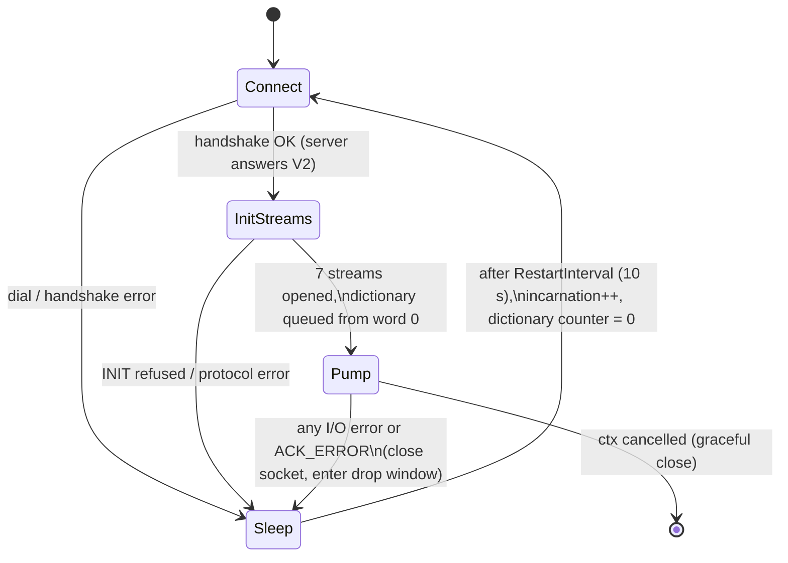

# Virtual dumper: behavioral contract

Status: contract for load-testing phase 2 (`load-testing-plan.md` §9.2). Owner: @vlsi.

The virtual dumper is a Go behavioral layer that reproduces the Java agent's remote-dump pipeline — the
`DumperThread` + `Dumper` + `DefaultCollectorClient` state machine — well enough that load numbers taken with it
can be trusted. It lives in `backend/libs/emulator/vdumper`, drives the wire through the existing
`libs/emulator.AgentConnection` transport, and is consumed by the `tools/load-generator/feeder` CLI in phase 2 and by
the k6 xk6 module (`tools/load-generator/pkg/cdt`) when phase 3 revives it.

Non-goals: run orchestration (ramp steps, artifact collection), k6 wiring, and any change to `pkg/cdt` — those are
phase 3+. The generator is synthetic and parameterized; no captured dumps or other binary fixtures enter the repo.

## 1. Reference behavior

Every rule in this contract is traced to the Java sources; when in doubt, the Java agent wins.

| Concern | Java source |
| --- | --- |
| Restart cadence, incarnations | `dumper/src/main/java/com/netcracker/profiler/dump/DumperThread.java` |
| Streams, flush loop, buffer steal, encodings | `dumper/src/main/java/com/netcracker/profiler/Dumper.java` |
| Handshake, acks, 1 KB write chop | `dumper/src/main/java/com/netcracker/profiler/client/DefaultCollectorClient.java` |
| Per-stream remote buffering, phrase framing | `dumper/src/main/java/com/netcracker/profiler/io/RemoteAndLocalOutputStream.java` |
| Phrase buffer semantics | `proto-definition/src/main/java/com/netcracker/profiler/cloud/transport/PhraseOutputStream.java` |
| Wire constants | `proto-definition/src/main/java/com/netcracker/profiler/cloud/transport/ProtocolConst.java` |

### 1.1 Lifecycle state machine



- `DumperThread.run` restarts the whole dumper after any failure, sleeping `DUMPER_RESTART_INTERVAL` (default 10 s)
  between incarnations. The first start does not sleep.
- Every (re)initialization resets the dictionary counter to zero (`Dumper.initialize`), so the full dictionary is
  re-sent, and the dictionary stream is opened with `resetRequired=1` (`resetExistingContents()` returns true exactly
  when the counter is zero).
- While the dumper is down (drop window), application threads keep producing; their chunks go nowhere. The virtual
  dumper counts these drops instead of pausing producers.
- Graceful shutdown flushes all streams, sends `COMMAND_CLOSE`, and closes the socket.

**Churn mode (T5 reconnect storms, phase 5).** With `ChurnInterval > 0` a *healthy* incarnation disconnects on
purpose after living that long past session-ready (± `ChurnJitter`, so a fleet does not cycle in lockstep): the
socket closes abruptly with no `COMMAND_CLOSE` — the CrashLoopBackOff shape, not a graceful shutdown — and the pod
takes the ordinary `Sleep → Connect` path with the full dictionary resend. The pod name never changes, so the
collector sees the same pod restarting (new restartMs directories, a growing pod-restart set). Churn cycles are
reported through a dedicated `Churned` stats event, never through `Disconnected` or the ack-error counter: a storm
run must still see real failures underneath the deliberate churn.

## 2. Wire contract

### 2.1 Handshake and socket

One TCP connection per pod incarnation. Socket options mirror `DefaultCollectorClient.openSocket`: keep-alive on,
read timeout 30 s (`PLAIN_SOCKET_READ_TIMEOUT`), 8 KB send/receive buffers.

Handshake: byte `COMMAND_GET_PROTOCOL_VERSION_V2` (0x14), fixed long `PROTOCOL_VERSION_V3` (100705), then fixed
strings `podName`, `microserviceName`, `cloudNamespace`; flush; read one fixed long. The Go collector always answers
`PROTOCOL_VERSION_V2` (100605), so the V3-only `posDictionary` branch never activates. `BLACK_LISTED_RESP` (88888888)
stops the pod permanently.

### 2.2 Stream set

Exactly the seven streams the Java agent sends to this collector, opened in `Dumper.initStreams` order:

| # | Stream | Framing | Header on every rotation | Per-connection state |
| --- | --- | --- | --- | --- |
| 1 | `trace` | raw | fixed long: process start epoch (ms) | file byte offset (for calls linkage) |
| 2 | `calls` | raw | fixed long `(0xFFFEFDFC<<32)\|4`, then fixed long base ms | thread-name table, calls timer (reset on rotation) |
| 3 | `xml` | raw | none | value offsets (for trace big-param refs) |
| 4 | `sql` | raw | none | dedup cache, 10 000 entries (cleared on rotation) |
| 5 | `dictionary` | phrase | none | words-sent counter (reset on reconnect) |
| 6 | `suspend` | phrase | fixed long: last suspend entry (ms) | last-entry timestamp |
| 7 | `params` | phrase | format byte + param records; then close | one-shot: written once per connection |

Framing:

- **raw** streams pass through a 1 KB `BufferedOutputStream`; bytes reach the wire as `COMMAND_RCV_DATA` payloads of
  at most `DATA_BUFFER_SIZE` = 1024 bytes (full 1 KB payloads while data is pending, a shorter tail at flush).
- **phrase** streams buffer up to `MAX_PHRASE_SIZE` = 10240 bytes and emit `[fixed int length][body]` phrases; a
  phrase is written out when the buffer is nearly full (`PhraseOutputStream.writePhrase`, high-water mark
  `buf.length - 200`) or at flush. Phrase bytes then pass through the same 1 KB chop.

Payload encodings are the ones `libs/tests/helpers/wire` already models (and `libs/parser/pipe` decodes): trace
chunks (`[threadId, startMs]` + events + `EVENT_FINISH_RECORD`), calls records (version 4, zig-zag start deltas,
thread table), var-strings with UTF-16 code-unit lengths, dictionary words, `(delta, duration)` suspend pairs, param
definitions.

Two corrections to the `load-testing-plan.md` §3 gap table follow from the Java sources:

- **G7.** The four `calls[100ms-500ms]`/… range streams and `callsDictionary` exist only when `localDumpEnabled`
  (`Dumper.java`: `writeCallRanges`, `writeCallsDictionary`); they are absent from `remoteStreams`. The collector
  refuses unknown streams (`libs/protocol/streams.go`), so a faithful generator sends the flat `calls` stream and
  shapes the *duration distribution* instead. The collector bins calls itself via `model.ClassifyDuration`
  (default thresholds 100 ms / 1 s / 10 s) plus the `call.red` error marker (`libs/collector/hotstore/store.go`).
- **G8.** `posDictionary` is opened only when the server answers V3 (`Dumper.initializeCollectorClient`); the Go
  collector answers V2. Neither `callsDictionary` nor `posDictionary` ever crosses the wire to this collector.

### 2.3 Stream open and rotation

`COMMAND_INIT_STREAM_V2` (0x15): fixed string name, fixed int requested rolling sequence id, fixed int
`resetRequired` (0/1); flush; response: UUID handle (null UUID → protocol error), fixed long rotation period (ms),
fixed long required rotation size, fixed int server-side sequence id. The client adopts `serverSeqId + 1` as its
index. Before any `INIT_STREAM_V2` all pending acks are drained synchronously
(`DefaultCollectorClient.attemptCreateRollingChunk`), so stream opens never interleave with data acks.

A stream rotates when the server-provided rotation period elapses or its size since rotation exceeds
`min(localThreshold, requiredRotationSize)`; local thresholds mirror the agent defaults (trace 100 MB, calls 10 MB,
sql/xml 100 MB, none for phrase streams). Rotation sends a fresh `INIT_STREAM_V2` (requested id = current index) and
re-emits the stream header per the table above. `resetRequired=1` is sent only for `dictionary`, and only while the
words-sent counter is zero — i.e. on the first open of a connection.

### 2.4 Ack protocol

| Event | Pending acks | Socket flush |
| --- | --- | --- |
| `COMMAND_RCV_DATA` (handle UUID + ≤1 KB payload) | +1 | no |
| `COMMAND_REQUEST_ACK_FLUSH` (0x11) | +1 | at flush cycle |
| ack byte received | −1 | — |

- Before each `RCV_DATA` the client drains acks *opportunistically* — only as many as are already readable
  (`validateWriteDataAcks(false)`, `in.available() > 0` in Java). Writes never block on acks between flushes.
- Every `FlushInterval` (default 5 s, `STREAM_FLUSH_INTERVAL`) the dumper flushes all seven streams in order. Each
  stream flush emits its buffered tail (raw tail `RCV_DATA` or pending phrase), then `REQUEST_ACK_FLUSH`, a socket
  flush, and a *synchronous* drain of all pending acks (`RollingChunkStream.flush` → `client.flush`). One flush cycle
  therefore produces up to seven `REQUEST_ACK_FLUSH` commands, each followed by a full drain.
- An ack byte ≥ 0 is the count of piggybacked collector commands; each command is a UUID plus a string, and the
  client answers `COMMAND_REPORT_COMMAND_RESULT` (0x13) + UUID + result byte. The virtual dumper reads the pairs and
  reports `COMMAND_FAILURE` (it has no diagtools to run).
- A negative ack byte: `ACK_ERROR_MAGIC` (−1) means the collector refuses data (backpressure); any other negative
  value is a protocol error. Both unwind to the reconnect path; `ACK_ERROR` is surfaced as a typed error so tests and
  stats can distinguish backpressure from breakage.
- A read timeout while waiting for acks (30 s) is a protocol error → reconnect.

The Go transport (`libs/emulator/connection.go`) currently deviates and must be fixed to match this table: it
appends `REQUEST_ACK_FLUSH` after every `RCV_DATA` (counting +2 acks), requires every ack byte to be exactly 0x00,
and treats `ACK_ERROR_MAGIC` as a generic failure.

### 2.5 Multiplexing

N producer goroutines per pod model application threads (`LocalBuffer` owners). Each producer fills a private chunk
buffer with call events under jittered delays; a buffer is handed to the dumper loop when full (tens of KB, mirroring
`LocalBuffer`) or when the 5 s buffer steal (`BUFFER_STEAL_INTERVAL`) claims a non-empty one. The dumper serializes
each handed-off buffer as one logical trace chunk in arrival order, so chunks from different threads interleave on
the wire exactly the way `Dumper.dumpLoop` interleaves stolen buffers. Closed root calls emit `calls` records
carrying the (`traceFileIndex`, `bufferOffset`, `recordIndex`) linkage into the trace bytes.

Two rules the calibration run proved material:

- **Dumper-injected tags.** On every recorded call the agent's dumper appends tag events right before the root exit:
  `common.started`, `node.name`, `java.thread` unconditionally, plus `time.cpu` / `time.wait` /
  `memory.allocated` for nonzero counter deltas (`Dumper.writeBufferToFS` + `writeCallParams`). They are a large
  share of the per-call trace bytes, so the virtual dumper emits them too.
- **Time compression.** A synthetic call completes now and started `duration` ago; the calls record keeps that true
  retroactive start (zig-zag deltas may run backwards), while the trace events — whose in-chunk deltas are unsigned
  and monotonic — compress onto the thread's event clock, capped at now. Retention classes and time buckets come
  from the calls record, so the load shape stays exact; only a /tree of a synthetic long call looks compressed.

## 3. Go contract

Package `backend/libs/emulator/vdumper`:

```go
// Transport is the protocol-level connection the virtual dumper drives.
// libs/emulator.AgentConnection implements it; phase 3 reuses it for the k6 module.
type Transport interface {
    Connect(ctx context.Context) error
    Handshake(protocolVersion uint64, namespace, service, pod string) (serverVersion uint64, err error)
    InitStream(name string, requestedSeqID int, resetRequired bool) (InitStreamReply, error)
    RcvData(handle common.Uuid, payload []byte) error // +1 pending ack, no flush
    RequestAckFlush() error                           // +1 pending ack
    DrainAcks(sync bool) error                        // sync=false drains only readable acks; AckError on ACK_ERROR_MAGIC
    Flush() error
    Close() error
}

// VirtualDumper runs one pod: the DumperThread lifecycle over a Transport.
type VirtualDumper struct{ /* Config, transport factory, Clock, StatsListener */ }
func (d *VirtualDumper) Run(ctx context.Context) error
```

- `Clock` abstracts `Now`/timers so lifecycle tests and the accelerated-timer soak (§7 T4) run on a fake clock.
- `StatsListener` receives bytes per stream, `RCV_DATA`/ack counts, ack errors, reconnects, drop counts, and three
  latency series with fixed semantics: `TcpConnected` (dial only), `SessionReady` (dial start → handshake answered and
  all seven streams open — the T3 accept-latency signal), and `AckFlushed` (per-stream synchronous ack drain inside the
  regular flush cycle only, excluding rotations and the params one-shot — the T2 ack-degradation signal). The feeder
  exposes them as logs/metrics; the k6 module maps them to k6 samples in phase 3.
- Producers → bounded chunk queue → dumper loop. Queue overflow during a drop window increments a drop counter;
  producers never block on a down dumper.
- Encoding primitives (`putVarString` with UTF-16 code-unit lengths, varints, zig-zag, fixed ints) move from
  `libs/tests/helpers/wire` into `libs/emulator/wire` so production code does not import test helpers;
  `tests/helpers/wire` re-exports them. The virtual dumper adds the stateful wrappers (thread-name table, sql dedup
  cache, phrase buffers, dictionary counter, trace file offsets).

## 4. Workload model and knobs

All knobs live in `vdumper.Config`; every run records its full parameter set (`load-testing-plan.md` §4).

| Knob | Models | Default |
| --- | --- | --- |
| `ThreadsPerPod` | producer goroutines (app threads) | 8 |
| `CallsPerSecPerThread` | root-call rate, jittered | 5 |
| `Duration` | log-normal call duration, or explicit shares over class thresholds | shares over 100 ms / 1 s / 10 s |
| `StackDepth` | enter/exit pairs per call (distribution) | geometric, mean 10 |
| `DictionaryInitial`, `DictionaryGrowthPerMin` | tag cardinality and churn | 2000, 10 |
| `SqlShare`, `SqlSize`, `SqlDedupHitRate` | calls carrying `PARAM_BIG_DEDUP` values | 0.2, log-normal ~1 KB, 0.9 |
| `XmlShare`, `XmlSize` | calls carrying `PARAM_BIG` values | 0.05, log-normal ~4 KB |
| `SuspendRate` | suspend events per second | 0.5 |
| `ErrorShare` | calls tagged with `call.red` (any_error class) | 0.01 |
| `CpuFraction`, `WaitFraction` | per-call cpu/wait counters as duration fractions | 0 (sleep-shaped reference) |
| `MemoryMeanBytes` | per-call `memory.allocated` counter | 4 KB |
| `ChunkMaxBytes` | producer buffer size (logical chunk) | 32 KB |
| `FlushInterval`, `BufferStealInterval`, `RestartInterval` | dumper timers | 5 s, 5 s, 10 s |
| `ChurnInterval`, `ChurnJitter` | deliberate abrupt disconnect of a healthy incarnation (§1.1 churn mode) | 0 (off), ±0.2 |

The generator does not model thread occupancy: producers emit at the configured rate even when
rate × mean duration exceeds one. When mirroring a real workload whose threads block for the call duration, set
`CallsPerSecPerThread` to the *observed* effective rate, not the nominal one.

Duration classes: the distribution is parameterized to land configurable shares into the collector retention tiers
(default thresholds 100 ms / 1 s / 10 s); the agent's local file classes (100 ms / 500 ms / 3 s / 60 m) remain
available as a preset. Error calls carry the `call.red` indexed param, which is what
`libs/collector/hotstore/seal.go` uses for the `any_error` class.

## 5. Test strategy

Contracts-first and synthetic; no golden byte snapshots, no captured dumps.

- A scripted in-process collector double speaks the server side of the protocol: answers handshakes and
  `INIT_STREAM_V2`, acks on schedule, and can delay acks, inject `ACK_ERROR_MAGIC`, piggyback commands, or drop the
  connection. Lifecycle tests run on a fake clock.
- Conformance tests (transport): ack accounting (+1 per `RCV_DATA`, no flush between cycles), opportunistic vs
  synchronous drains, piggybacked command handling, typed `AckError`.
- Lifecycle tests (vdumper): `ACK_ERROR` → drop window → reconnect after `RestartInterval` → all seven streams
  re-opened, dictionary re-sent from word 0 with `resetRequired=1`; graceful shutdown flushes and closes; churn
  mode disconnects abruptly (no `COMMAND_CLOSE`), re-sends the dictionary with `resetRequired=1` every cycle, and
  counts through `Churned` — not `Disconnected`, not the ack-error counter.
- Interleaving test: decode the `RCV_DATA` sequence from the double and assert logical chunks of several thread ids
  interleave within one flush window.
- Decodability: generated streams round-trip through `libs/parser/pipe` (trace, calls, dictionary, suspend, params,
  sql/xml offsets resolve).
- Shape tests: generated duration-class shares, dictionary growth, sql/xml shares, and error share land within
  statistical tolerance of the configured knobs.

Backend tests are Go (`*_test.go` beside the code), matching the existing `backend/` convention; the Kotlin-tests
rule applies to JVM modules.

## 6. Calibration (phase-2 exit criterion)

One calibration run compares the virtual dumper's traffic profile against the real agent
(`load-testing-plan.md` §3). Material divergence is fixed in the emulator, never tuned away in the thresholds.

Tooling, under `tools/load-generator/calibrate/`:

- A decoding TCP tap proxies agent ↔ collector and understands both directions: `INIT_STREAM_V2` (building the
  handle → stream map), `RCV_DATA` (per-stream byte timeline), `REQUEST_ACK_FLUSH`, and the ack bytes. Output is a
  JSON profile: bytes/s per stream in 1 s buckets, `RCV_DATA` size histogram, flush/ack cadence, ack latency, and a
  reconnect timeline.
- The tap can corrupt one chosen ack into `ACK_ERROR_MAGIC`, which exercises the reconnect path of the *real* agent
  without collector changes.

Runs:

- **Run A (reference):** the real Java agent, driven the way `libs/tests/smoke_realagent` drives it, running a new
  steady-load `LoadMain` in `test-app` (parameters: calls/s, duration mix, sql/xml params; 2–5 min).
- **Run B:** the virtual dumper with knobs mirroring the `LoadMain` workload.

Pass criteria:

- per-stream bytes/s ratio A/B within ×1.5;
- ack cadence matches: acks cluster at the 5 s flush cycle, same `REQUEST_ACK_FLUSH` count per cycle;
- after an injected `ACK_ERROR`: reconnect within 10 ± 2 s, all streams re-opened, dictionary re-sent with
  `resetRequired=1` — identical in A and B.

Results are recorded in `load-testing-plan.md` (phase-2 status section).

## 7. Gap disposition

| Gap (`load-testing-plan.md` §3) | Closed by | Contract section |
| --- | --- | --- |
| G1 no `trace` stream | trace pipeline | §2.2, §2.5 |
| G2 no cross-stream multiplexing | producers + chunk queue | §2.5 |
| G3 no `ACK_ERROR_MAGIC` handling | typed `AckError` + reconnect | §2.4, §1.1 |
| G4 no agent-style reconnect | lifecycle state machine | §1.1 |
| G5 `resetRequired` hardwired to 0 | dictionary reset on reconnect | §2.3 |
| G6 flush after every `RCV_DATA` | 5 s flush cycle, ack accounting | §2.4 |
| G7 no duration-class shaping | duration distribution knobs (corrected: classes are collector-side) | §2.2, §4 |
| G8 missing streams | `sql`, `xml`, `params` added (corrected: `callsDictionary`/`posDictionary` never cross the wire) | §2.2 |
| G9 no load-shape knobs | `vdumper.Config` | §4 |
